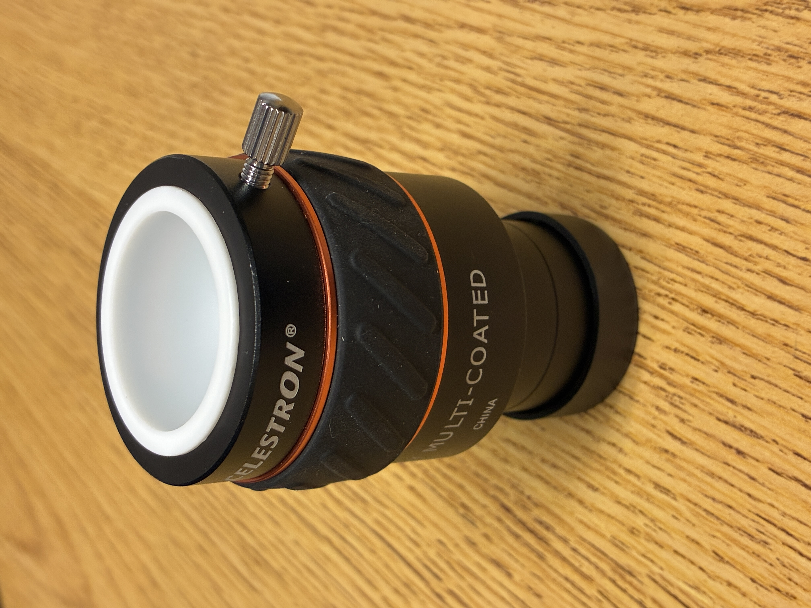
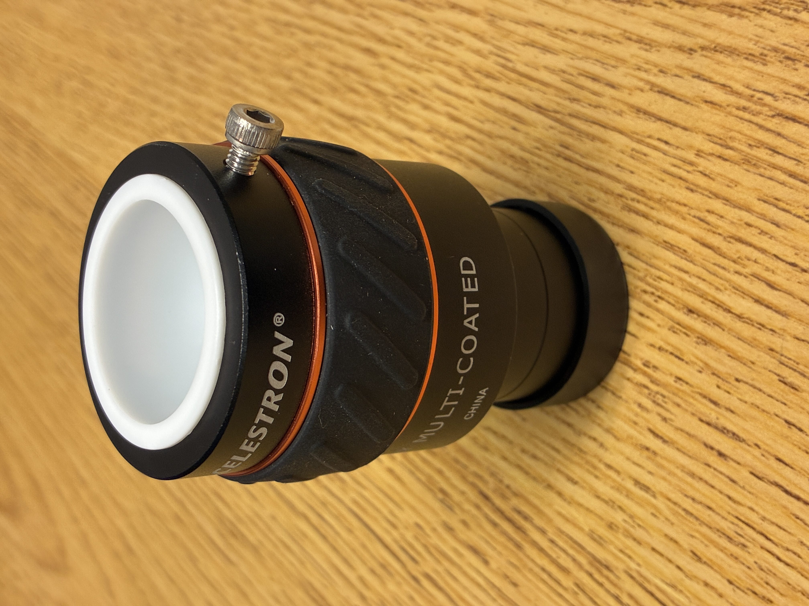
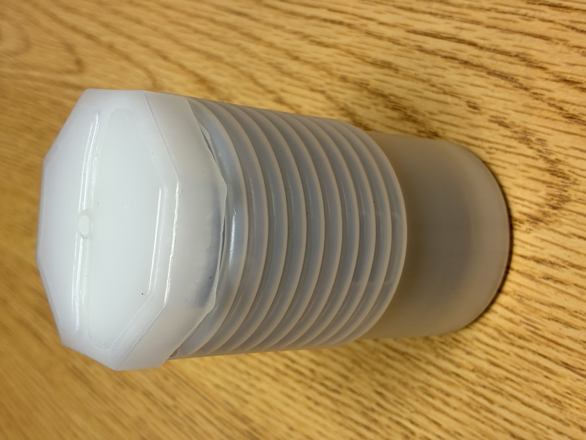

# Celestron X-Cel LX 2× Barlow Lens

I bought this in August 2026.

## Screw and Case

I bought some X-Cel LX eyepieces at the same time as the Barlow lens; they have rather nice plastic cases. In contrast, the Barlow lens is just packed in a bag in a cardboard box. One of the plastic cases became available because of an unfortunate accident with one of the eyepieces, and I thought to use it for the Barlow lens. Unfortunately, while the main barrel of the Barlow lens fits quite nicely in the case, the screw that tightens the compression ring is long enough to jam. I solved this problem by replacing it with a M4×10 screw with a more compact head. The Barlow lens now fits quite nicely in the plastic case.

<figcaption>The Barlow lens with the original screw.</figcaption>

<figcaption>The Barlow lens with shorter replacement screw.</figcaption>

<figcaption>The Barlow lens with the shorter screw in the plastic case.</figcaption>
