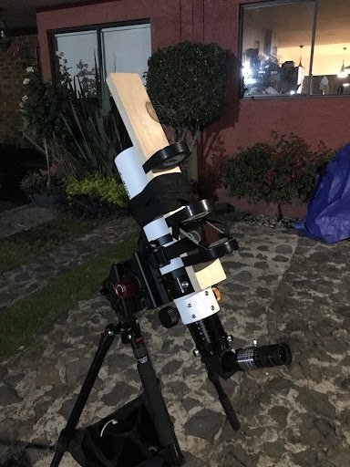
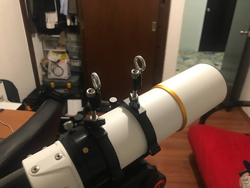
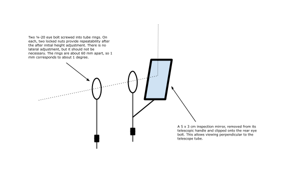
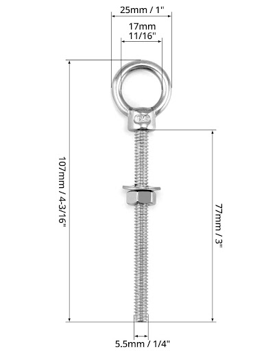
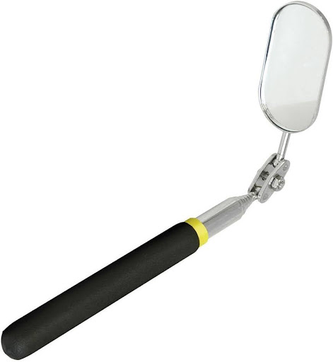
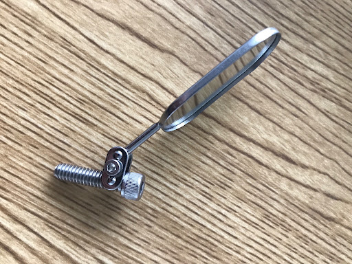
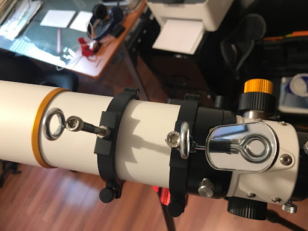
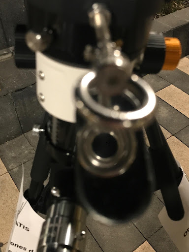

# Iron Sights for the SV70

## 2023-11-25

At the Noche de Estrellas, moving between Jupiter and Saturn, I discovered that sighting along the tube does not give me sufficient accuracy to get a target in the 3.8 degree field of the 32 mm eyepiece. I decided I either needed iron sights, a laser, or a red-dot sight.

## 2023-11-26

I experimented with two rolls of black tape fixed to a piece of wood and strapped to the telescope. I used a small vanity mirror at 45 degrees to sight through the central apertures perpendicular to the tube. The eye is very good at centering circles, which mitigates parallax. It worked very well, moving between Saturn and Jupiter. Each time, the planet fell in the eyepiece. Viewing perpendicular to the tube was very comfortable. However, obviously this prototype is not a practical implementation of this idea.

## 2023-11-27

I worry about using a laser around people when public viewing. A reflex sight might work well, but I’m going to continue to try to develop a practical iron sight.

I came up with the idea of using two eye bolts mounted on a metal strip that screws into the tube rings. One of the fastening screws would pass through a slot to give lateral adjustment and both of the eyebolts could be adjusted in height. If these could be aligned to 1 mm at 20 cm, they would give a precision of about 0.3 degree.

I experimented with two eye bolts with 12 mm apertures taped to 60 mm ¼-20 screws on the rings (since the eye bolts did not have ¼-20 threads). They worked very well, at least inside.

This encouraged me to try ¼-20 eye bolts threaded directly into the rings; these would not give lateral adjustment and only coarse vertical adjustment (half a turn is 1/40 of an inch or about 0.64 mm). A pair of locking nuts on each would allow the height to be repeatable and prevent the eye bolts from extending inside the ring and scratching the telescope tube.

I came up with the idea of using an inspection mirror to see from 90 degrees. It could fasten to a bolt head or onto eye bolt thread.

I ordered from Amazon:

- [Eye bolts](https://www.amazon.com.mx/gp/product/B0B3MYNJJ4/ref=ppx_yo_dt_b_asin_title_o00_s00?ie=UTF8&th=1) These are ¼-20 with a nice circular aperture, 17 mm ID and 25 mm OD, and a total height of about 107 mm. They can be cut down if needed. The packet has 10, with washers and bolts. They are stainless steel, and so will be illuminated by ambient light. $343.  

- [Inspection mirror](https://www.amazon.com.mx/gp/product/B01089C7BW/ref=ppx_yo_dt_b_asin_title_o01_s00?ie=UTF8&psc=1). This has a 5 x 3 cm mirror on a telescopic handle. I plan to remove the telescope handle and attach the ball clip to the rear eye bolt. $105.

A 17 mm aperture seen from a distance of 12 cm corresponds to about 8 degrees on the sky, about twice the field of the telescope with a 32 mm eyepiece. If these can be aligned to even 1 mm, this gives a precision of about 0.5 degree.

If need be, these parts could be easily adapted to a plate. This would give lateral and vertical adjustment and permit the front ring to be further from the rear ring.

## 2023-12-01

The inspection mirror arrived.

I measured the mirror to be about 25 x 50 mm in size, so seen at 45 degrees will be about 25 x 35 mm.

In order to grip a ¼-20 screw, I had to replace the M3 screw in the ball joint with a slightly longer M3x12 screw. (A 4-40 x ½ screw and 4-40 nut would probably also have been fine). The new screw takes a 2.5 mm hex key, which is already part of my kit. The nut takes a 5.5 mm wrench, which I do not have, but simply gripping it with fingers or pliers is adequate.

I checked it out (inside) with the prototype rings. It seemed to work fine. In particular, the field seemed to be wide enough.

I also had these ideas for L-R and U-D adjustment.

## 2023-12-04

The ¼-20 eye-bolts arrived. I discovered the holes in the telescope rings are M6. I am an idiot, since I had tested them with M6 bolts prior to ordering these bolts. I ordered [M6 versions](https://www.amazon.com.mx/tuercas-ganchos-inoxidable-tornillo-elevación/dp/B0BQ3CMM6X?pd_rd_w=gzqrb&content-id=amzn1.sym.1cfe0e03-3559-4bbb-920a-6eec54e61732&pf_rd_p=1cfe0e03-3559-4bbb-920a-6eec54e61732&pf_rd_r=2RXCVYSA233EETVF12EB&pd_rd_wg=cuYNn&pd_rd_r=72dcaac7-b53a-4dd6-83ba-8d489210c81a&ref_=pd_bap_d_csi_prsubs_0_t&th=1) of the same style of eyebolt:

The mirror is about 45 mm from the center of the ball to the center of the mirror. Thus, it needs to be attached about 32 mm below the centre of the ring. And below that we need two bolts, about 10 mm, and about another 5 mm to thread into the telescope rings. So, at a minimum, we need 47 mm from the center of the eye to the end of the bolt.

## 2023-12-13

Fernando Ángeles helped me grind two flat surfaces on one of the M6 eye bolts to make the mechanical connection from the mirror a little more robust.

## 2024-01-12

I tried this out during a session of sidewalk astronomy in the center of Tlalpan. It worked very well. I would center Jupiter in the rings, and it would appear in the 32 mm eyepiece. The mirror allowed me to comfortably view the field through the sighting rings.

*The view in the mirror: Jupiter and the two sighting rings.*

There is no left-right adjustment. Mounting either the front ring or both rings on a plate with left-right adjustment might be useful.
